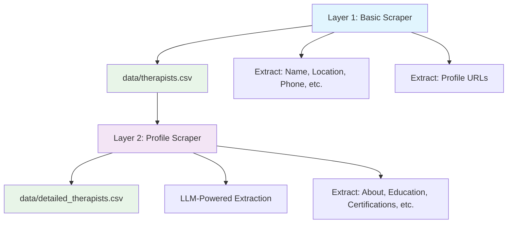

# Two-Layer Web Scraper for Healthcare Professionals

A sophisticated web scraping system designed to extract healthcare professional data in two layers: basic listing information and detailed profile data. The system uses both traditional CSS selectors and LLM-powered extraction for maximum adaptability.

## 🏗️ Project Structure

```
web-scrapper/
├── README.md                          # This file
├── requirements.txt                   # Python dependencies
├── .gitignore                        # Git ignore rules
├── .env                              # Environment variables (API keys)
│
├── config/                           # Configuration files
│   ├── layer1_config.py             # Layer 1 scraping configuration
│   └── layer2_config.py             # Layer 2 profile scraping configuration
│
├── src/                              # Source code
│   ├── layer1_basic_scraper/         # Layer 1: Basic listing scraper
│   │   ├── __init__.py
│   │   └── main.py                   # Main Layer 1 scraper
│   │
│   ├── layer2_profile_scraper/       # Layer 2: Detailed profile scraper
│   │   ├── __init__.py
│   │   ├── profile_scraper_main.py   # Main Layer 2 scraper
│   │   ├── llm_profile_scraper.py    # LLM-powered profile extraction
│   │   └── profile_scraper.py        # Traditional profile scraper
│   │
│   └── shared/                       # Shared utilities and models
│       ├── __init__.py
│       ├── models/                   # Data models
│       │   ├── __init__.py
│       │   └── doctor.py             # Doctor/Therapist data model
│       └── utils/                    # Shared utilities
│           ├── __init__.py
│           ├── data_utils.py         # CSV handling utilities
│           ├── scraper_utils.py      # Web scraping utilities
│           └── pagination.py         # Pagination handling
│
├── scripts/                          # Workflow scripts
│   └── run_complete_workflow.py      # Complete two-layer workflow runner
│
├── tests/                            # Test files
│   ├── test_enhanced_workflow.py     # Enhanced workflow tests
│   └── test_profile_scraping.py      # Profile scraping tests
│
├── data/                             # Output data files
│   ├── therapists.csv               # Layer 1 output: Basic data + profile URLs
│   └── detailed_therapists.csv      # Layer 2 output: Enhanced profile data
│
└── outputs/                          # Additional output directory (if needed)
```

## 🚀 Quick Start

### Prerequisites

1. **Python 3.8+** installed
2. **Anthropic API Key** for LLM-powered extraction (Claude)
3. **Virtual environment** (recommended)

### Installation

```bash
# Clone the repository
git clone <repository-url>
cd web-scrapper

# Create virtual environment
python -m venv myenv
source myenv/bin/activate  # On Windows: myenv\Scripts\activate

# Install dependencies
pip install -r requirements.txt

# Set up environment variables
cp .env.example .env
# Edit .env and add your OpenAI API key
```

### Environment Variables

Create a `.env` file in the root directory:

```env
ANTHROPIC_API_KEY=your_anthropic_api_key_here
```

## 🎯 Usage

### Option 1: Complete Workflow (Recommended)

Run both layers automatically:

```bash
python scripts/run_complete_workflow.py
```

### Option 2: Layer-by-Layer Execution

**Layer 1: Basic Data Extraction**
```bash
cd src/layer1_basic_scraper
python main.py
```
Output: `data/therapists.csv` with basic data + profile URLs

**Layer 2: Profile Enhancement**
```bash
cd src/layer2_profile_scraper
python profile_scraper_main.py --mode enhance
```
Output: `data/detailed_therapists.csv` with enhanced profile data

### Option 3: Testing and Development

**Test Profile Detection:**
```bash
cd src/layer2_profile_scraper
python profile_scraper_main.py --mode test
```

**Standalone Profile Scraping:**
```bash
cd src/layer2_profile_scraper
python profile_scraper_main.py --mode standalone --url "https://example.com/profile"
```

## 📊 Data Flow



## 🎛️ Configuration

### Layer 1 Configuration (`config/layer1_config.py`)

Currently supports 3 websites:
- **psychotherapeutensuche.de** - German therapist directory
- **apa_locator** - American Psychological Association locator
- **apollo247.com** - Indian healthcare platform

Key configuration parameters:
```python
SITE_CONFIG = {
    'psychotherapeutensuche': {
        'base_url': 'https://www.psychotherapeutensuche.de/therapeuten/',
        'css_selectors': {...},
        'pagination': {...},
        'required_fields': [...]
    }
}
```

### Layer 2 Configuration (`config/layer2_config.py`)

LLM-powered extraction with site-specific instructions:
```python
PROFILE_SITE_CONFIG = {
    'psychotherapeutensuche': {
        'profile_detection_prompt': "...",
        'profile_extraction_prompt': "...",
        'url_patterns': [...],
        'url_cleaning_rules': {...}
    }
}
```

## 🧠 Why Building a Generalized Web Scraper is Challenging

### 1. **Website Structure Variations**

**Challenge**: Every website has unique HTML structures, CSS classes, and layouts.

**Site-Specific Requirements**:
- **CSS Selectors**: Each site requires different selectors for the same data
  ```python
  # Site A
  'name': '.therapist-name h2'
  # Site B  
  'name': '.profile-title .name-field'
  # Site C
  'name': 'div[data-testid="doctor-name"]'
  ```

**Our Solution**: Site-specific configuration files with CSS selector mappings.

### 2. **Dynamic Content Loading**

**Challenge**: Modern websites use JavaScript to load content dynamically.

**Site-Specific Requirements**:
- **Wait Conditions**: Different sites load content at different speeds
- **Interaction Requirements**: Some sites need clicks, scrolls, or form submissions
- **Session Management**: Login requirements, CSRF tokens, cookies

**Our Solution**: 
- Use `crawl4ai` with browser automation
- Site-specific wait conditions and interaction patterns
- Session management per site

### 3. **Anti-Bot Measures**

**Challenge**: Websites implement various anti-scraping measures.

**Site-Specific Requirements**:
- **Rate Limiting**: Different sites have different tolerance levels
- **User Agents**: Some sites block common scraper user agents
- **CAPTCHAs**: Human verification challenges
- **IP Blocking**: Geographic or frequency-based restrictions

**Our Solution**:
```python
# Site-specific rate limiting
DELAY_BETWEEN_PAGES = 2  # seconds
BATCH_BREAK_TIME = 30    # seconds after every 10 pages

# Random user agents
USER_AGENTS = [
    'Mozilla/5.0 (Windows NT 10.0; Win64; x64)...',
    'Mozilla/5.0 (Macintosh; Intel Mac OS X 10_15_7)...'
]
```

### 4. **Data Format Inconsistencies**

**Challenge**: Same information is presented differently across sites.

**Site-Specific Requirements**:
- **Date Formats**: MM/DD/YYYY vs DD.MM.YYYY vs ISO format
- **Address Formats**: Different country/region conventions
- **Phone Numbers**: Various international formats
- **Name Formats**: "First Last" vs "Last, First" vs "Dr. First Last"

**Our Solution**: Site-specific data cleaning and normalization functions.

### 5. **Pagination Patterns**

**Challenge**: Every site implements pagination differently.

**Site-Specific Requirements**:
```python
# Site A: Next button
'next_page_selector': 'a.next-page'

# Site B: Page numbers
'pagination_selector': '.pagination a[data-page]'

# Site C: Load more button
'load_more_selector': 'button[data-action="load-more"]'

# Site D: Infinite scroll
'scroll_trigger': True
```

### 6. **Profile URL Patterns**

**Challenge**: Profile URLs follow different patterns and structures.

**Site-Specific Requirements**:
```python
# Different URL patterns per site
URL_PATTERNS = {
    'psychotherapeutensuche': [
        r'/therapeuten/[^/]+/\d+/',
        r'/[^/]+-\d+/$'
    ],
    'apa_locator': [
        r'/profile/\d+',
        r'/psychologist/[^/]+/\d+'
    ]
}

# URL cleaning rules
URL_CLEANING_RULES = {
    'remove_fragments': True,
    'normalize_paths': True,
    'fix_malformed': True
}
```

### 7. **Content Extraction Complexity**

**Challenge**: Extracting meaningful data from unstructured HTML.

**Site-Specific Requirements**:
- **Nested Structures**: Data buried in complex HTML hierarchies
- **Mixed Content**: Text mixed with images, links, and formatting
- **Language Variations**: Multi-language sites with different structures
- **Schema Variations**: Different sites organize the same information differently

**Our Solution**: LLM-powered extraction with site-specific prompts:
```python
PROFILE_EXTRACTION_PROMPT = """
For {site_name}, extract the following information:
- About/Bio: Look for sections like "About", "Biography", "Description"
- Education: Find degree information, universities, graduation years
- Certifications: Professional licenses, board certifications
- Specializations: Areas of expertise, treatment approaches
...
Site-specific notes:
- This site puts education in a "Qualifications" section
- Certifications are listed under "Professional Memberships"
- Contact info is in the sidebar, not main content
"""
```

## 🔧 Hardcoded Parameters Required

To successfully scrape any website, these parameters typically need to be configured:

### 1. **Structural Selectors**
```python
CSS_SELECTORS = {
    'container': '.therapist-card',           # Main container for each item
    'name': '.name-field',                    # Professional's name
    'location': '.address-info',              # Location/address
    'phone': '.contact-phone',                # Phone number
    'profile_link': 'a.profile-link'          # Link to detailed profile
}
```

### 2. **Pagination Configuration**
```python
PAGINATION_CONFIG = {
    'next_page_selector': '.pagination .next',
    'page_number_selector': '.page-numbers a',
    'max_pages': 50,
    'delay_between_pages': 2
}
```

### 3. **Request Headers**
```python
HEADERS = {
    'User-Agent': 'Mozilla/5.0...',
    'Accept': 'text/html,application/xhtml+xml...',
    'Accept-Language': 'en-US,en;q=0.9',
    'Accept-Encoding': 'gzip, deflate, br',
    'Referer': 'https://example.com'
}
```

### 4. **Rate Limiting**
```python
RATE_LIMITING = {
    'delay_between_requests': 1.5,    # seconds
    'batch_size': 10,                 # requests per batch
    'batch_break_time': 30,           # seconds between batches
    'max_retries': 3,                 # retry failed requests
    'backoff_factor': 2               # exponential backoff
}
```

### 5. **Data Validation Rules**
```python
VALIDATION_RULES = {
    'required_fields': ['name', 'location'],
    'phone_format': r'^\+?[\d\s\-\(\)]+$',
    'email_format': r'^[^@]+@[^@]+\.[^@]+$',
    'url_format': r'^https?://.+',
    'min_name_length': 2,
    'max_description_length': 5000
}
```

### 6. **Error Handling**
```python
ERROR_HANDLING = {
    'timeout': 30,                    # request timeout in seconds
    'max_redirects': 5,               # maximum redirects to follow
    'retry_status_codes': [429, 502, 503, 504],
    'ignore_ssl_errors': False,
    'handle_cloudflare': True
}
```

## 🎯 Benefits of Our Two-Layer Approach

1. **Separation of Concerns**: Basic extraction vs. detailed enhancement
2. **Fault Tolerance**: If Layer 2 fails, you still have Layer 1 data
3. **Scalability**: Can run layers independently or in parallel
4. **Flexibility**: Different extraction strategies per layer
5. **Cost Efficiency**: Use expensive LLM calls only for detailed data

## 🔍 Monitoring and Debugging

### Log Files
- Layer 1 logs: Basic extraction progress and errors
- Layer 2 logs: LLM API calls and profile extraction details
- Error logs: Failed requests and parsing errors

### Success Metrics
- **Layer 1**: Number of profiles found, profile URLs extracted
- **Layer 2**: Successful profile enhancements, data completeness
- **Overall**: Total records, data quality scores

## 🤝 Contributing

1. Fork the repository
2. Create a feature branch
3. Add new site configurations in `config/`
4. Update CSS selectors and LLM prompts
5. Test with the new site
6. Submit a pull request

## 📝 License

This project is licensed under the MIT License - see the LICENSE file for details.

## ⚠️ Disclaimer

This tool is for educational and research purposes. Always:
- Respect robots.txt files
- Follow website terms of service
- Implement appropriate rate limiting
- Consider the legal implications of web scraping in your jurisdiction

## 🆘 Support

For issues and questions:
1. Check the existing issues on GitHub
2. Review the configuration examples
3. Test with the provided test scripts
4. Create a new issue with detailed information

---

**Happy Scraping! 🕷️** 